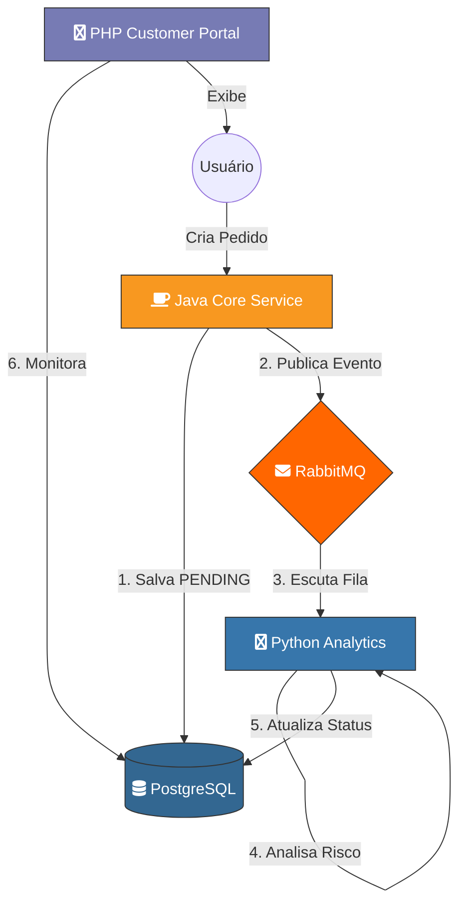

# 🚀 Polyglot-Flow: Distributed Transaction & Analytics System

Este projeto demonstra uma **Arquitetura de Microserviços Poliglota** projetada para alta escalabilidade e resiliência. O sistema simula um ecossistema de e-commerce onde cada linguagem foi escolhida estrategicamente para resolver um problema específico, comunicando-se através de mensageria assíncrona.

## 🏗️ Arquitetura do Sistema

O sistema é composto por três serviços principais que operam de forma desacoplada:

1. **Order Service (Java 17 / Spring Boot):**
* **Papel:** Core transacional e gestão de pedidos.
* **Responsabilidade:** Recebe pedidos via REST, persiste no banco e publica eventos de "Pedido Criado".
* **Stack:** Spring Data JPA, Hibernate, Spring Cloud Stream (RabbitMQ).


2. **Intelligence Service (Python 3.11):**
* **Papel:** Worker de análise de risco e antifraude.
* **Responsabilidade:** Consome eventos do RabbitMQ, aplica regras de negócio e atualiza o status do pedido no banco de dados.
* **Stack:** Pika (RabbitMQ Client), Psycopg2 (PostgreSQL Client).


3. **Customer Portal (PHP 8.2 / Laravel 11):**
* **Papel:** Backend-for-Frontend (BFF) e Dashboard.
* **Responsabilidade:** Fornece uma interface em tempo real para o cliente monitorar o status dos seus pedidos.
* **Stack:** Blade Templates, Eloquent ORM.


---

## 🔄 Fluxo de Dados (C4 Model)



---

## 🚀 Decisões de Engenharia

* **Event-Driven Architecture:** O serviço de análise (Python) não bloqueia a finalização do pedido. O sistema utiliza consistência eventual para garantir alta disponibilidade.
* **Interoperabilidade de Dados:** Tratamento de mapeamento de dados entre Java Records e Dicionários Python, garantindo a integridade dos nomes das chaves (ex: `orderId` vs `id`).
* **Database Constraints:** Sincronização de Enums entre a camada de aplicação Java e as Check Constraints do PostgreSQL.
* **Docker Orchestration:** Uso de *Healthchecks* avançados para garantir que os serviços só subam após a infraestrutura (DB/Rabbit) estar 100% pronta.

---

## 🛠️ Tecnologias Utilizadas

* **Linguagens:** Java, Python, PHP.
* **Mensageria:** RabbitMQ.
* **Banco de Dados:** PostgreSQL & Redis.
* **Infraestrutura:** Docker & Docker Compose.

---

## ⚙️ Como Executar

1. Clone o repositório:

```bash
git clone https://github.com/seu-usuario/polyglot-flow.git

```

2. Suba o ambiente completo:

```bash
docker-compose up -d --build

```

3. Acesse os serviços:

* **Dashboard (PHP):** `http://localhost:8000`
* **Order API (Java):** `http://localhost:8080`
* **RabbitMQ Manager:** `http://localhost:15672` (guest/guest)

---

## 📈 Próximos Passos (Roadmap)

* [ ] Implementar Cache com Redis no Portal PHP.
* [ ] Adicionar autenticação JWT entre os serviços.
* [ ] Dashboard em tempo real usando WebSockets.
