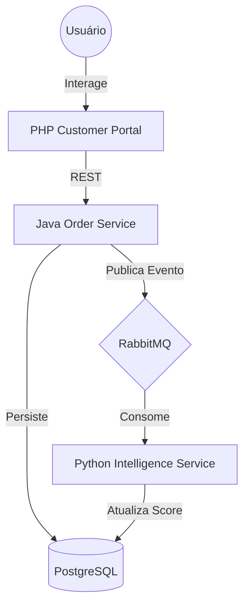

# Polyglot-Flow: Distributed Transaction & Analytics System

Este projeto demonstra uma arquitetura de microserviços poliglota projetada para escalabilidade, resiliência e alta coesão. O sistema simula um ecossistema de e-commerce onde cada linguagem foi escolhida especificamente por suas forças no ecossistema de software atual.

## 🏗️ Arquitetura

O sistema é composto por três serviços principais que comunicam de forma híbrida (Síncrona via REST e Assíncrona via Mensageria):

1. **Order Service (Java/Spring Boot):**
* **Papel:** Core transacional e gestão de estado.
* **Stack:** Spring Data JPA, PostgreSQL, Spring Cloud Stream.
* **Por que Java?** Segurança de tipos, robustez em transações ACID e ecossistema maduro para regras de negócio complexas.


2. **Intelligence Service (Python/FastAPI):**
* **Papel:** Processamento de dados e análise de risco/sentimento.
* **Stack:** Pandas, Scikit-learn, RabbitMQ.
* **Por que Python?** Facilidade de integração com bibliotecas de manipulação de dados e IA para análise de pedidos em tempo real.


3. **Customer Portal (PHP/Laravel):**
* **Papel:** Backend-for-Frontend (BFF) e interface administrativa.
* **Stack:** Laravel 11, Blade/Livewire, Redis.
* **Por que PHP?** Velocidade de desenvolvimento para interfaces web, excelente gestão de sessões e entrega rápida de UI.


### Fluxo de Dados (C4 Model Preview)



## 🚀 Decisões de Engenharia (Senior Mindset)

* **Desacoplamento:** O serviço de análise (Python) não bloqueia a finalização do pedido (Java). A comunicação é eventual.
* **Resiliência:** Implementação de *Circuit Breakers* para evitar falhas em cascata entre o Portal PHP e o Core Java.
* **Observabilidade:** Centralização de logs e métricas (preparado para Prometheus/Grafana).
* **Segurança:** Autenticação via JWT propagada entre os serviços.

## 🛠️ Como Executar

O projeto utiliza Docker para orquestração total.

```bash
git clone https://github.com/seu-user/polyglot-flow.git
cd polyglot-flow
docker-compose up -d

```

## 📈 Roadmap

* [ ] Implementação de Testes de Integração entre serviços.
* [ ] Adição de Keycloak para Auth centralizada.
* [ ] Dashboard em tempo real com WebSockets no PHP.